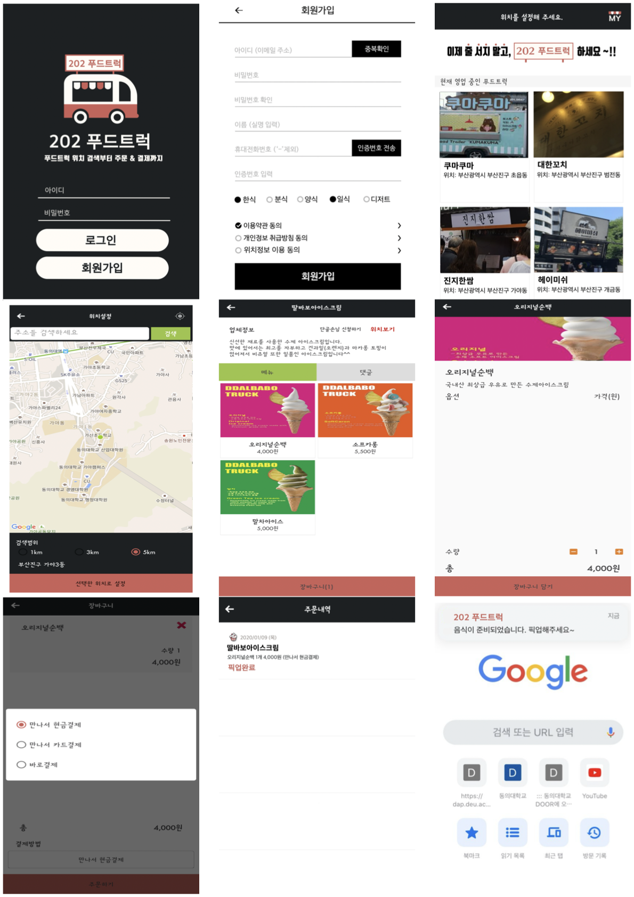

# 인공지능을 이용한 푸드트럭 앱 기획
**AI FOOD TRUCK APP**

> 동의대학교 융복합 캡스톤 디자인 프로젝트 최종 결과물

## 프로젝트 개요

기존 푸드트럭 플랫폼의 한계를 넘어, **트럭의 실시간 위치 정보 · 결제 데이터 · 사용자 선호도**를 융합한 AI 기반 맞춤형 푸드트럭 추천 시스템 기획입니다.

하이브리드 추천 알고리즘(협업 필터링 + 콘텐츠 기반 필터링)을 설계하여 사용자 맞춤형 서비스를 제공하고, 편의성과 서비스 만족도를 극대화하는 것을 목표로 합니다.

## 프로젝트 정보

| 항목 | 내용 |
|------|------|
| 기간 | 2020.01.02 ~ 2020.01.10 (8일) |
| 학교 | 동의대학교 |
| 학과 | 컴퓨터공학과 / 컴퓨터 소프트웨어 공학과 |
| 담당 교수 | 이승헌 교수님 |
| 팀명 | 202 (이백이) |
| 팀장 | 이현경 |
| 팀원 | 이지은, 백소현 |

## 기술 스택

- **Design & Prototyping**: Figma
- **AI Algorithm (Conceptual)**: Hybrid Recommendation System
  - Collaborative Filtering (협업 필터링)
  - Content-based Filtering (콘텐츠 기반 필터링)
- **구현 도구 (계획)**: Python, Jupyter Notebook

## 프로젝트 배경 및 필요성

### 시장 현황

- 축제·행사 증가로 푸드트럭 창업 수가 꾸준히 늘고 있으나, 서울시 기준 폐업률이 **32.5%** 에 달함
- 창업 지원 2년 후 잔존 푸드트럭 비율은 **38%** 에 불과
- 소비자 불편의 핵심: 푸드트럭 특유의 **이동성** 으로 인해 원하는 트럭을 실시간으로 찾기 어려움

### 기존 앱의 한계

- 단순 위치 정보 및 영업 현황 제공에 그침
- 소비자 맞춤 추천 기능 부재
- 지속적인 피드백·업데이트 부족

## 핵심 기능

### 1. AI 하이브리드 추천 엔진

| 단계 | 방식 | 설명 |
|------|------|------|
| 초기 (신규 가입) | 콘텐츠 기반 필터링 | 회원가입 시 선택한 선호 음식(한식·분식·양식·일식·디저트)을 기반으로 추천 |
| 이후 (데이터 축적) | 협업 필터링 | 주문 내역 데이터를 분석해 비슷한 성향의 사용자가 선택한 트럭·메뉴 추천 |

> 콜드 스타트 문제를 콘텐츠 기반 필터링으로 해결하고, 데이터가 쌓인 후 협업 필터링으로 전환하는 **진 르 터우탸오(今日头条)** 방식을 참고하여 설계

### 2. 주요 앱 기능

- **위치 기반 트럭 탐색**: GPS 또는 주소 검색으로 반경 1km / 3km / 5km 내 영업 중인 트럭 조회
- **푸드트럭 상세 정보**: 메뉴, 가격, 운영시간, 위치 확인
- **3단계 결제 시스템**: 만나서 현금결제 / 만나서 카드결제 / 바로 결제
- **스마트 픽업 알림**: 음식 준비 완료 시 푸드트럭 사업자가 알림 발송
- **리뷰 시스템**: 픽업 완료 사용자만 리뷰 작성 가능
- **주문 내역 관리**: 날짜·메뉴·수량·금액·결제방법·픽업여부 확인

## UI/UX 화면 구성

| 화면 | 주요 기능 |
|------|-----------|
| 로그인 / 회원가입 | 아이디·비밀번호·이름·휴대전화 인증, 선호 음식 선택 |
| 메인 화면 (위치 설정 전) | 선호 음식 기반 콘텐츠 필터링 추천 |
| 위치 설정 화면 | GPS 또는 주소 검색, 반경 설정 |
| 메인 화면 (위치 설정 후) | 근처 영업 중인 트럭 목록 + 선호 음식 우선 정렬 |
| 푸드트럭 상세 | 업체 정보, 위치, 사용자 리뷰 |
| 메뉴 선택 / 장바구니 | 수량 선택, 가격 확인, 결제 방법 선택 |
| 주문 내역 | 주문 기록 확인 |
| 픽업 알림 | 음식 준비 완료 알림 수신 |
| 협업 필터링 추천 화면 | 누적 주문 데이터 기반 맞춤 추천 |

## 기대 효과

- **소비자**: 이동하는 푸드트럭을 실시간으로 파악하고, 취향에 맞는 트럭·메뉴를 손쉽게 발견
- **사업자**: 앱을 통해 위치·서비스 홍보로 인지도 향상, NFC 연동 간편 결제로 매출 증대
- **시장**: 푸드트럭 폐업률 감소 및 시장 활성화 기여

## 설계 목표 달성도

| 목표 | 중요도 | 달성도 | 수행 내용 |
|------|--------|--------|-----------|
| AI 알고리즘 | 50% | 45% | 하이브리드 추천 시스템 선정 및 사용 도구 조사 |
| AI 이론 조사 | 15% | 15% | 머신러닝·딥러닝·협업/콘텐츠 필터링 이론 정리 |
| 푸드트럭 분석 | 15% | 15% | 시장 현황 및 기존 앱 문제점 분석 |
| 앱 UI 제작 | 20% | 15% | Figma 와이어프레임 및 목업 설계 |
| **합계** | **100%** | **90%** | |

## 한계점 및 개선 사항

### 한계점

1. **짧은 수행 기간 (8일)**: 와이어프레임·기능 기획 단계까지만 완료, 상세 시스템 아키텍처 및 DB 물리 설계 미진행
2. **사업자 앱 범위 제외**: 초기 기획에 포함했던 사업자용 앱이 추천 시스템의 본질(소비자 편의)과 맞지 않아 과감히 제외

### 향후 계획

- 협업 필터링 알고리즘 정확도 개선
- Python + Jupyter Notebook을 활용한 추천 모델 실제 구현
- 기획안을 바탕으로 완성도 높은 앱 개발 진행

## 문서

- [상세 기획 결과 보고서](docs/콜라보+프로젝트+결과보고서.pdf)
- [발표 자료](docs/202%20발표자료.pptx)
